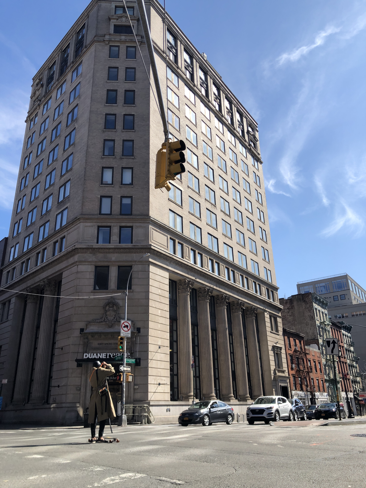

Welcome to the sights of a strange and quiet NYC during the Covid-19 shutdown. Like millions of our neighbors we are sheltering in place, but our bike rides for exercise offer glimpses of how much things have changed.

> Deserted Times Square

> Bezos is getting richer by the minute

> Not death yet, post no bills

> Empty parking structure in SoHo - this would normally be full to the brim with cars

> Half the people you see on the streets now are taking photos

> Lafayette and Howard

> Empty fruit stand in Chinatown

> 6th Avenue and 33rd

> 6th Avenue and 42nd

> Central Park ✌🏻
