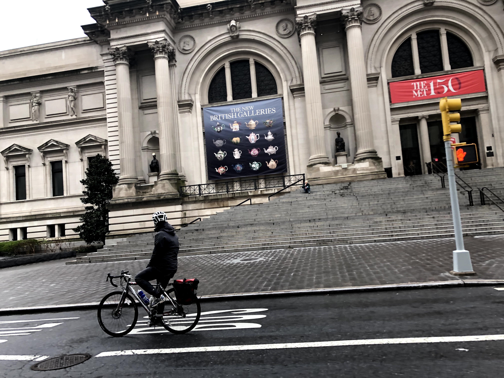
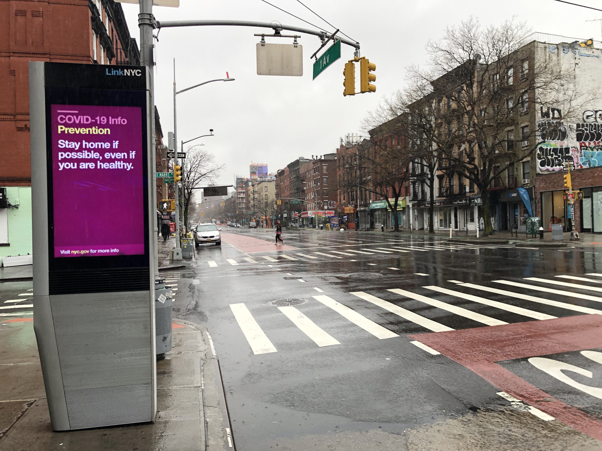
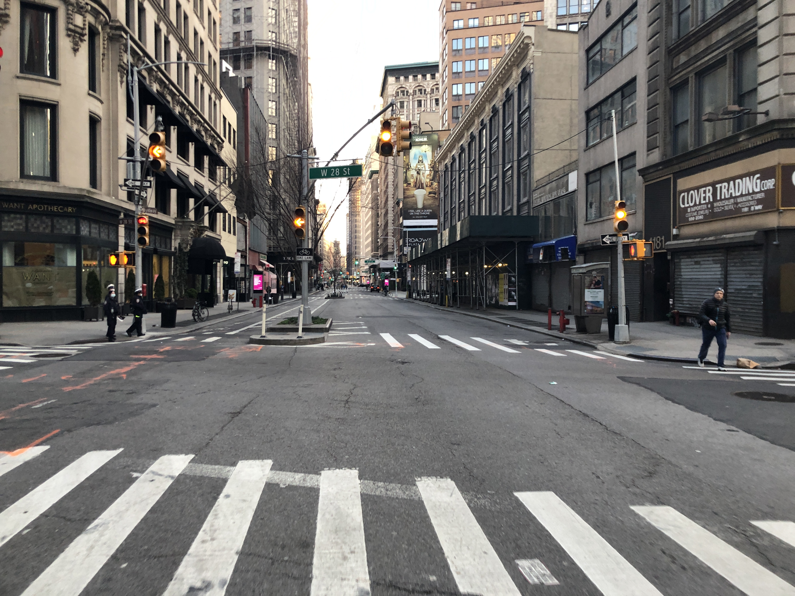
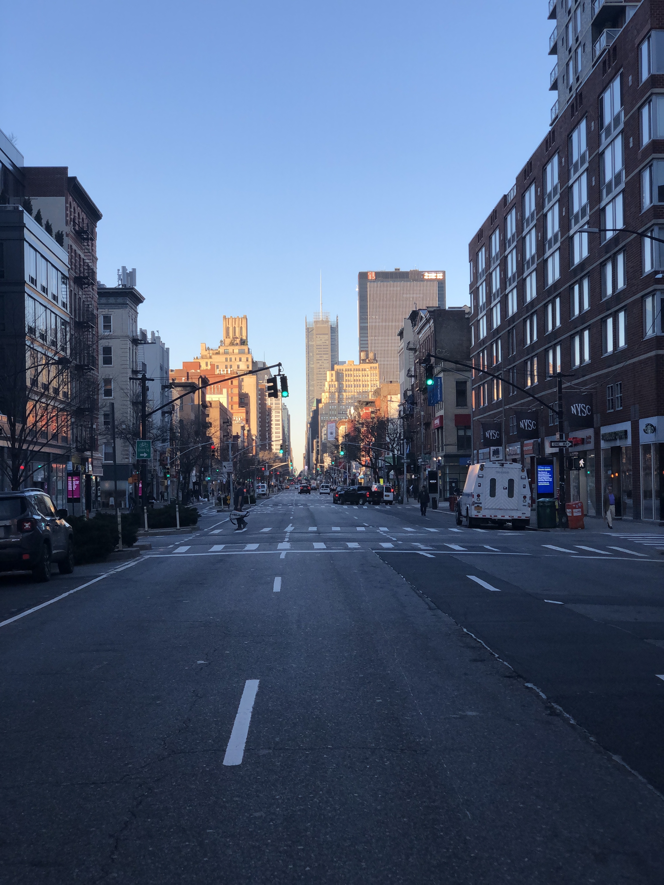
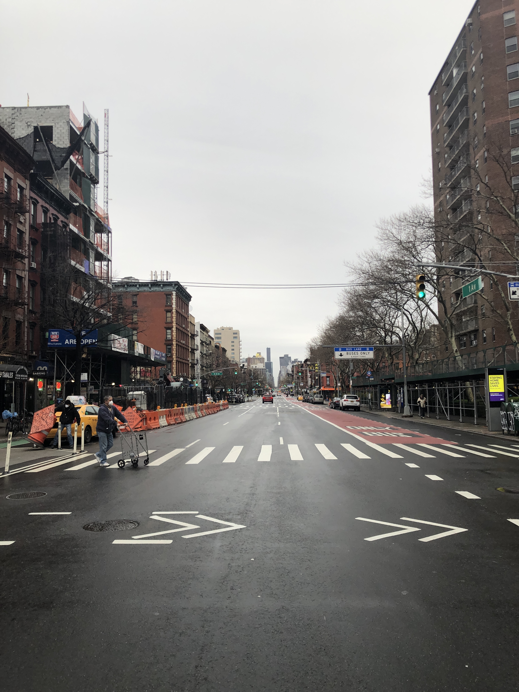
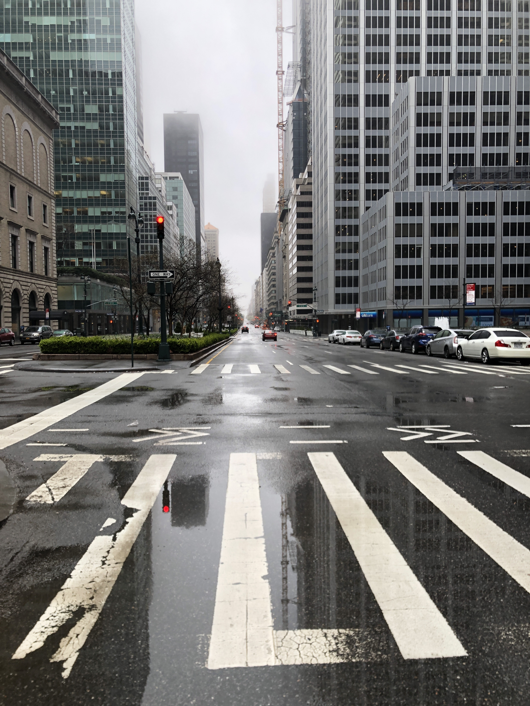

> Park Avenue closed for recreation

> Upper roadway of Grand Central, normally accessible only to cars

> Jolyon as Vanderbilt

> The British Galleries at the Met 🇬🇧

> Stay home if possible, even if you are healthy.

> Times Square like a zombie movie

> Hand sanitizer $10

> Broadway and 28th

> 8th and 16th

> 1st and 4th

> Rainy foggy Park Avenue

> Field hospital being build in Central Park
